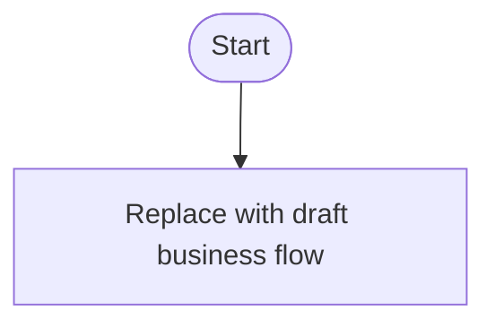

# Gate 1 Flow Sketch

## Purpose

This is an early review artifact. Confirm or correct this sketch before the full Gate 1 PRD/EARS/BDD/review artifacts are generated.

## Source Inputs

- Source requirement:
- Context inventory:
- Related open questions:

## Draft Scenario List

| Scenario ID | Actor / Role | Trigger | Main Flow Summary | Observable Outcome | Status |
|---|---|---|---|---|---|

## Draft Operation Flow

1.

## Draft State Model

Use this section only when state transitions matter.

| State | Trigger | Next State | Business Rule | Question ID |
|---|---|---|---|---|

## Draft User Flow Diagram

- Mermaid source: `diagrams/user-flow.mmd`
- SVG status:

## Critical Question References

Keep mutable question text, recommendation and rationale, answer, blocking
status, and lifecycle status only in `15-open-questions.md`.

| Question ID | Flow Area / Purpose | Canonical Register |
|---|---|---|

## Material Assumption Decision Audit

Resolve unresolved material assumptions one at a time through the durable
decision loop before final Gate 1 approval.

| Assumption ID | Assumption Summary | Affected Artifacts | Question / Decision Link |
|---|---|---|---|

## Human Correction Notes

- Flow confirmed: yes/no
- Corrections requested:
- Decisions to carry into Gate 1:

## Next Step

After this sketch is confirmed or corrected, generate full Gate 1 artifacts:

- `10-gate1-prd.md`
- `11-gate1-ears.md`
- `12-gate1-bdd.feature`
- `13-gate1-review.html`
