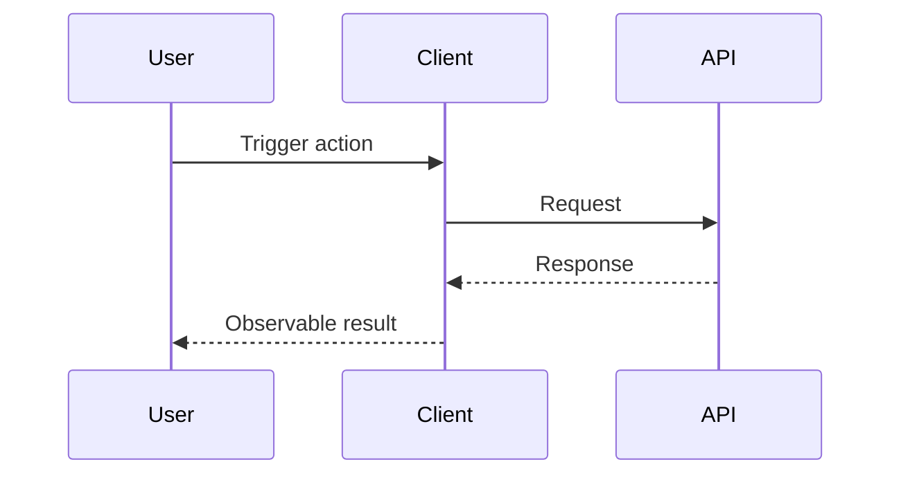
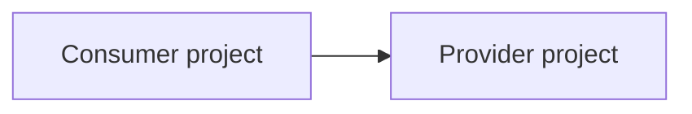

# Gate 2 Solution Sketch

## Purpose

This is an early human confirmation micro-gate before full Gate 2 solution artifacts are generated.

Use this file to confirm the API flow, cross-project direction, project responsibilities, solution assumptions, Test ID direction, vertical capability slices, and parallel ownership seams while changes are still cheap.

## Source Inputs

- Confirmed Gate 1 PRD:
- Confirmed Gate 1 EARS:
- Confirmed Gate 1 BDD:
- Context inventory:
- Verified architecture sources:
- Accepted `UNVERIFIED` risks:

## Sketch Status

- Required: yes/no
- Status: drafted / waiting-for-user / confirmed / revised / skipped-trivial / superseded
- Skip reason, if skipped:
- Human confirmation date:

## Verified Context Summary

| System / Project | Inventory Status | Verified Source | Key Fact Used In Sketch |
|---|---|---|---|

## Draft API Flow

Diagram source: `diagrams/api-flow.mmd`

## Draft Cross-Project Flow

Use this section only when multiple projects or systems are involved.

Diagram source: `diagrams/cross-project-flow.mmd`

## Project Responsibility Split

| Project / System | Responsibility | Likely Modify? | Read-Only Reference? | Reason |
|---|---|---|---|---|

## Provider / Consumer Direction

| Provider | Consumer | Contract / Integration | Release Order Concern |
|---|---|---|---|

## Key Solution Assumptions To Confirm Or Override

| Assumption ID | Assumption | Suggested Default | Affected Artifacts | Blocking? | User Decision |
|---|---|---|---|---|---|

## Blocking Solution Questions

| Question ID | Question | Suggested Default | Why It Matters | Affected Artifacts | Blocking? | Answer |
|---|---|---|---|---|---|---|

## Initial Test ID Coverage Direction

| BDD Scenario | Proposed Test ID | Automation Level | Test Contract Needed? | Notes |
|---|---|---|---|---|

## Initial Capability Slice Plan

| Slice / Enabler | User- Or System-Observable Outcome | End-To-End Validation Route | Layers Needed | Reason For Boundary | Needs Human Confirmation? |
|---|---|---|---|---|---|

## Initial Parallel Ownership Plan

| Proposed Wave | Task / Slice | Depends On | Exclusive Ownership Paths | Shared Contract / Seam | Integration Owner | Conflict Concern |
|---|---|---|---|---|---|---|

## Human Correction Notes

Record any user corrections before full Gate 2 generation.

## Next Step

After the user confirms or corrects this sketch, generate full Gate 2 artifacts:

- `20-gate2-project-impact.md`
- `21-gate2-technical-design.md`
- `22-gate2-constitution-compliance.md`
- `24-gate2-test-strategy.md`
- `proposed-context-update.md`
- `25-gate2-review.html`
